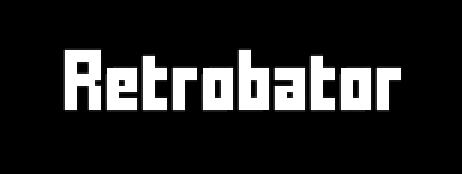

This is the hub for Retrobator, a NES emulator available on [Steam](https://store.steampowered.com/app/3282220/Retrobator/) and Itch.io (coming soon).

To report an issue, see [Issues](https://github.com/arrectis/retrobator-home/issues) or contact [support@arrectis.com](mailto:support@arrectis.com) directly.

## Downloads ##

(Check here periodically for updates.)

To install, download the PNG file above and open it in Retrobator.
You can also download the mod in ZIP form [here](Supplemental%20Package.zip).

## Features ##

- **Timeline** - Use the Timeline slider to go back in time, watch again, or restart gameplay from any point.
- **Map** - Reveal traversed areas of the game by simply zooming out or by using a wide aspect ratio.  Replays are also shown on top of the map for your entertainment.
- **Butter Mode** - Interpolation enables smoother background and sprite movement, especially during slow-motion (re)play.
- **Backgrounds** - Replace in-game 'sky' pixels with custom or generated* images.
- **Audio** - Smooth and unmixed audio channel waveforms, with adjustable octaves for deeper bass.
- **AI Integration*** - Interact with your own [AI agent](#what-is-an-ai-assistant).
- **Other Features** - Fast-forward, rewind, slo-motion, input lag mitigation, CRT mode, save states and more.

## FAQ ##

### What is Retrobator? ###
Retrobator is a nes emulator aiming to deliver a new experience.
I plan to achieve this by:
- Implementing rare or novel features.
- Integrating AI for interactivity and voice control.
- Providing a platform for the community to build upon.

### Who is behind this? ###
A single highly-motivated insane man.

### What are the supported platforms? ###
Windows is the only officially supported platform at the moment, with others tentatively planned.  If you have a particular platform in mind, let me know [here](https://github.com/arrectis/retrobator-home/issues).

### What games are supported? ###
Although most games are compatible with Retrobator, a few notable games are not at this time.  If you want a particular game to be supported, let me know [here](https://github.com/arrectis/retrobator-home/issues).

### Where do I find games to use with Retrobator? ###
Retrobator requires NES games in digital file form (typically called 'ROMs'). You can find indie NES games in digital form on [Itch.io](www.itch.io). 

When it comes to classic NES games, I can't help you there. Personally, I've used INLRetro and RetroBlaster hardware to create digital backups of games that I physically own, which is how I source my ROMs.

### What are custom backgrounds? ###
A background is essentially an image that you provide that will display behind the game screen.  
Retrobator makes a best guess at which game pixels are 'default background pixels' on the current game frame, and allows the custom background to show through them.

While this technique works well for some games / game areas, it is very prone to error; you will often see the custom background bleed through game tiles where it should not.
The simple solution (if a bit tedious) is to highlight the problematic game tiles (using the [tile labels](#what-are-tile-labels) menu) and flag them as 'opaque'.

You can also download tile labels that were created by others if they are available. See [here](#what-kinds-of-things-can-be-imported-and-exported-tofrom-retrobator) for more information.

### What is an AI assistant? ###
This is an __optional__, __experimental__ feature that is provided as a downloadable mod, and __requires OpenAI API credit to use.__
Alternate AI providers may be available in the future.

What you can do with the AI assistant:
- Command your AI assistant (via voice or text) to do various things for you: Open games, load cheats, generate backgrounds, etc. 
- Converse, banter, and have your assistant react to in-game [events](#what-are-events)*.
- Give your AI different personalities.

Note: This is currently utilizing OpenAI's _Advanced Voice Mode_, which is currently in 'Preview'.  This means that:
- This service may have a daily limit. As of this writing, it does.
- This service may suffer from outages or changes that will cause the assistant to go down. Check this page for updates to the OpenAI mod that may address these changes.
- The "bring your own key" (BYOK) model Retrobator uses for connecting to OpenAI may change in the future, or may even be nuked by OpenAI. If this happens, expect a transition period to a different model.
- AI services like this are likely to get better, cheaper, and more ubiquitous in the coming months and years. 

### How do I use the AI Assistant? ###
First, you must install the supplemental package found on [this page](#downloads).

Finally, you must provide an OpenAI API key to Retrobator:
1. Create an OpenAI API developer platform account on their site. (Currently [platform.openai.com](platform.openai.com))
2. Add some _Pay as you go_ credit. (Currently in the settings under _Billing_)
3. In the Dashboard, create an API key, and copy it.
4. In Retrobator, open the OpenAI window, and paste the key into the field.

This will allow Retrobator to communicate with OpenAI on your behalf. 
_Note: Retrobator does not store or share your OpenAI API key. However, it may include application state in its messages to the API._

### What are events? ###
Retrobator does not send video of your gameplay session to the AI assistant.  So, how does it know what's happening in-game? 

That's where _events_ come in. Example events:
- Game opened (built-in)
- Player died
- Game over
- Finished stage

etc.

__Retrobator does not recognize events by default;__ you must provide examples of each event in order to "teach" Retrobator how to identify them on a per-game basis. Alternatively, you can import pre-defined events that others have exported; some event labels for some games have been provided in the [supplement package](#downloads).

The general procedure for labelling events is as follows:
- Load up a game.
- Play it for a while; long enough to provide multiple examples of a specific event you want to identify.
- Select 'Event Labels' in the main menu.
- Mark __all__ occurrences of the event happening in the timeline.
  This means marking a frame before and frame after the example event occured.
- Discover the event and label it appropriately.

### What are tile labels? ###
Graphics are made up of squares of pixels called 'tiles'.  Together, these tiles form things like enemies, items, characters, etc.
Using Retrobator, you can highlight and group tiles you see in-game.

Thus far, tabelled tiles have a couple of uses:
- Marking tiles as 'Opaque', so that custom backgrounds do not bleed through.
- Providing the AI assistant knowledge of what is showing on screen when an event occurs.

The procedure for labelling tiles is fairly straightforward:
- Open a game.
- While playing, find some graphics you want to label.
- Select 'Tile Labels' in the main menu.
- Using a mouse, select and highlight the thing you want to label, including all of its tiles.
- Right-click on the highlight to group the tiles into a 'tile group'.
- Optionally label the tile group with the name of it (duplicate names are allowed) or set other flags.

### What kinds of things can be imported and exported to/from Retrobator? ###
- Custom backgrounds (game-specific)
- Tile labels, event labels (game-specific)
- Mods (AI providers, etc.)

A _package_ can contain any number of the above items, and can be embedded in a .png or .zip file.  See the [supplemental](#downloads) package as an example.

### How do mods work? ###
Mods are simply C# code files that are compiled and cached at runtime that interact with Retrobator.
The mod API is evolving, and is not yet documented.

Before enabling any mods, be sure to inspect the code and confirm that they are safe to use.

### I found an issue or I have a suggestion. How do I forward it to your brain? ###
See [Issues](https://github.com/arrectis/retrobator-home/issues).
